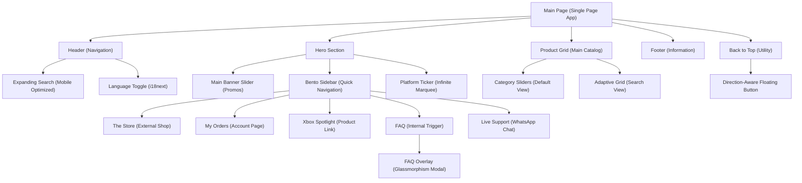

# Redeem Storefront | Project Documentation v1.4

This document serves as the master record for all UI/UX enhancements, technical implementations, and brand-consistent features developed for the **Redeem (redeem-dz.com)** React storefront.

## 0. Site Map (Architecture)

## 1. Core Visual Identity
- **Aesthetic**: Premium, minimalist Apple-inspired design.
- **Background**: Clean, light base (`#f5f5f7`).
- **Brand Colors**: Signature Red (`#e11e3b`) used for action buttons, icons, highlights, and the "Back to Top" button.
- **Typography**: 
  - Reduced font weight for all titles (Category titles, Product names, Bento labels) to `font-[600]` (Semi-bold) for a sophisticated look.
  - Font families: `font-kufi` for Arabic and `font-sans` for English.
- **Corner Curvature (v1.4 Optimization)**:
  - Systematically reduced `border-radius` across the site for a sharper, more refined aesthetic.
  - Product Cards: Outer container (`16px`), Image container (`12px`).
  - Hero Slider & Bento: (`12px` - `16px`).
  - Platform Cards: (`12px`).
  - Modal/FAQ Overlays: (`24px`).

## 2. Navigation & User Experience
- **Mobile Expanding Search**: 
  - On focus, the search bar expands to 100% width.
  - Logo and Action buttons are hidden via Framer Motion during search.
- **Localization (i18next)**: 
  - Full RTL/LTR support for all core components.
  - Flag icons optimized with minimal curvature (`rounded-[2px]`) for a proportional look.
- **Back to Top Utility (v1.4)**:
  - Floating button that appears after scrolling down 300px.
  - **Dynamic Colors**: Outlined transparent design with black/gray elements, switching to brand red on hover.
  - **Positioning**: Automatically flips based on direction (Bottom-Left for RTL, Bottom-Right for LTR).

## 3. Hero & Bento Sidebar
The Hero section features a high-performance "Bento-style" navigation grid:
- **Main Slider**: Features high-quality promos with localized SVG typography.
- **Bento Tiles**:
  - **The Store (المتجر)**: Linked to `/shop/` with `faStore` icon.
  - **My Orders (طلباتي)**: Account link via `faShoppingBag`.
  - **Xbox Spotlight**: Trending product featuring **Xbox Game Pass Ultimate** with custom green badge.
  - **FAQ Overlay**: Triggers a premium **Glassmorphism Overlay**.

## 4. Platform Storefront Ticker
- **High-Fidelity Assets**: Official SVG logos for major gaming platforms.
- **Premium Dimensions**: 240px x 120px cards.
- **Refined Corners**: Reduced curvature to `rounded-xl` (12px) for consistency with the new design system.

## 5. Product System & Adaptive Layout
- **App Store-Style Sliders**: Horizontal category sliders with physical drag-to-scroll.
- **Floating Navigation**: "Next/Prev" arrows appear on hover for desktop.
- **Adaptive Grid Search**: Automatic switch to a multi-column vertical grid during active search.
- **Curvature Polish**: Sharper corners for product thumbnails to enhance the luxury feel.

## 6. Premium FAQ Integration
- **Glassmorphism Modal**: `backdrop-blur-2xl` and `white/80` transparency.
- **Accordion Navigation**: Smooth transitions for Q&A sections.
- **Optimized Corners**: Modal rounded at `24px` (`rounded-3xl` equivalent) for a modern popup feel.

## 7. Technical Stack
- **Framework**: React 19 (Vite)
- **Animations**: Framer Motion 12+
- **Styling**: Tailwind CSS
- **Localization**: react-i18next
- **PWA**: Powered by `vite-plugin-pwa` for offline capabilities.

---

## Changelog

| Version | Date | Change |
|---------|------|--------|
| v1.0 | 2026-04-13 | Initial documentation — core UI, Hero, Bento, Product Grid, PWA |
| v1.1 | 2026-04-13 | Added **Platform Ticker** (Infinite marquee below hero) |
| v1.2 | 2026-04-15 | **Modernized Platform Ticker**: High-fidelity SVGs, brand colors, 240px card width. |
| v1.3 | 2026-04-16 | **UX Major Update**: Integrated FAQ Overlay, App Store-style horizontal category sliders, and Adaptive Grid Search logic. |
| v1.4 | 2026-04-16 | **UI Polish & Utilities**: Unified curvature reduction across all containers, reduced flag icon rounding, and added the direction-aware **Back to Top** floating button. |

*Last Updated: 2026-04-16*
